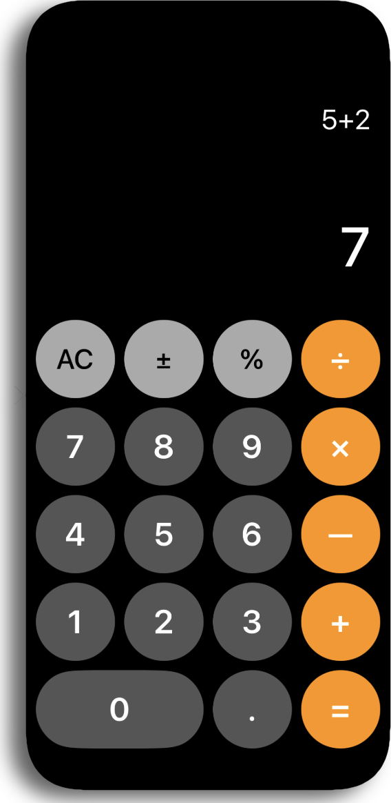

# calculator-app

<br><br>
This project is a basic iOS calculator application, similar to the default Calculator app on iOS devices. It allows users to perform basic arithmetic operations such as addition, subtraction, multiplication, and division, as well as other common functionalities like percentage, negative values, and decimal points.

## Features

- **Basic Arithmetic Operations**: Supports addition, subtraction, multiplication, and division.
- **Percentage Calculation**: Allows users to calculate percentages using the `%` button.
- **Negative Numbers**: The app provides a button to switch a positive number to a negative number.
- **Clear Button**: Resets the current input and calculation history.
- **Decimal Support**: Users can input decimal numbers.
- **Input Validation**: Ensures that only valid expressions are evaluated, and provides an alert in case of invalid input (e.g., consecutive operators, invalid characters).
- **Real-time Calculation**: The result is displayed as the user types the expression.

## Screenshot


## Code Overview

### ViewController

The main logic of the app is implemented in `ViewController.swift`. Here's an overview of the important methods:

- **clear()**: Clears the current input and resets the display.
- **addToWorkings(_ value: String)**: Updates the displayed expression as the user taps buttons.
- **evaluateExpression()**: Uses `NSExpression` to evaluate the current expression and display the result.
- **isSpecialCharacter(_ char: Character) -> Bool**: Checks if the input is a special character like `+`, `-`, `*`, `/`, or `.`.
- **isInputValid(_ input: String) -> Bool**: Ensures that the expression is valid (e.g., no two operators in a row).
- **formatResult(result: Double) -> String**: Formats the result to show either an integer or a decimal, depending on the calculation.

### Buttons

Various buttons (numbers and operators) are connected to actions in the view controller:

- **Numeric buttons**: `tapZero()`, `tapOne()`, ..., `tapNine()` — add respective numbers to the expression.
- **Operators**: `tapPlus()`, `tapMinus()`, `tapMultiply()`, `tapDivide()` — add the operator to the expression.
- **Special buttons**: 
  - `tapPercent()`: Calculates the percentage of the current value.
  - `tapNegative()`: Toggles the current number to a negative value.
  - `tapClear()`: Resets the calculator.
  - `tapEqual()`: Evaluates the current expression.
  - `tapDecimal()`: Adds a decimal point to the current number.

## Usage

To use the app:
1. Tap the buttons to input your expression.
2. Press `=` to evaluate the expression.
3. Use `AC` to clear the current input.
4. The `%` button calculates percentages.
5. The `±` button toggles positive/negative numbers.

## Installation

1. Clone the repository:

   ```bash
   git clone https://github.com/allenvox/calculator-app
   ```

2. Open the project in Xcode:

   ```bash
   cd calculator-app
   open calculator-app.xcodeproj
   ```

3. Build and run the project in the Xcode simulator or on a physical device.

## License

This project is open-source and available under the [MIT License](LICENSE).
